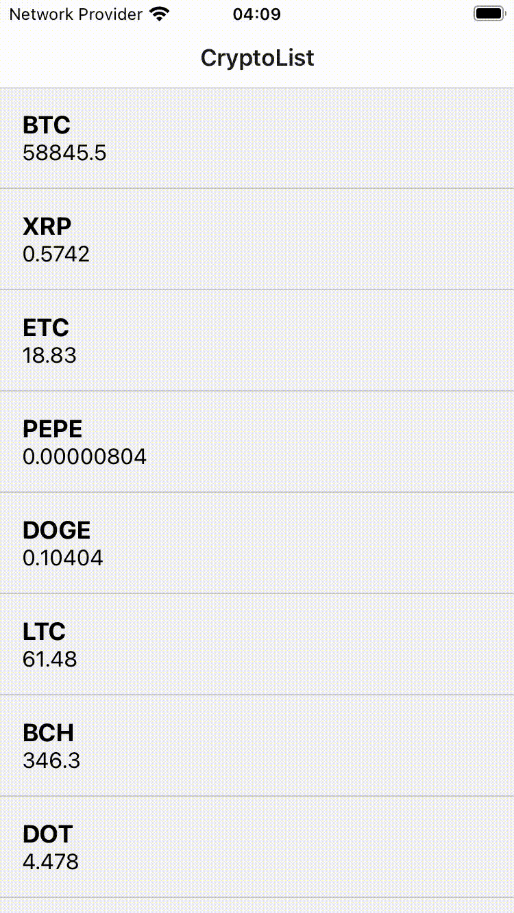

# Getting Started



###  Step 1: Setup

```bash
yarn
pod install --project-directory=ios

```

###  Step 2: Start the App
```bash
npx react-native start --experimental-debugger --reset-cache
```
on another window:
```bash
npm run ios
```
(not tested on Android device)

###  Step 3: Unit Tests

```bash
npm run test -- --coverage
```

###  Troubleshooting

If you can't get it work, feel free to reach me.

### The Workflow

There are two main screens for listing and details of cryptos
```
- screens
-- CryptoDetails.tsx
-- CryptoList.tsx
```
`@react-navigation/native` is used to navigate between the screens

The data is retrieved inside custom hooks using an Observable provided by `RxJs` library. 

An RxJs/interval subscription is created on each screen and unsubscribed when the screen is not focused or unmounted.

Redux state manager is used to store the retrieved data, to be reached inside the view components.

View components, helper functions and hooks separated to create a clean view in the screens. 

In the Api service `useMock` defined for local builds demonstration.
```
const useMock = true;
```
